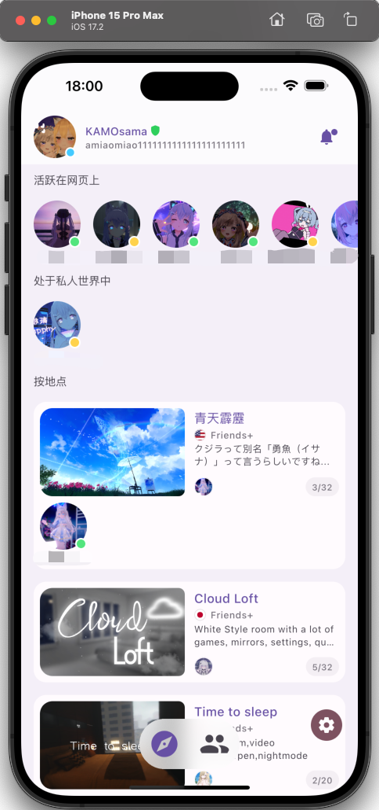
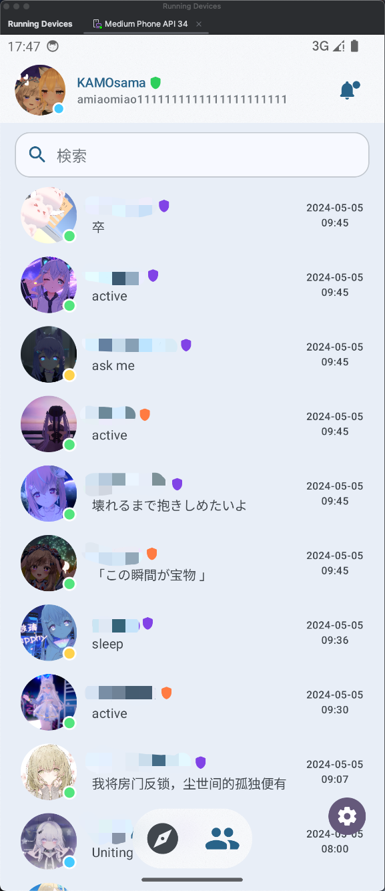
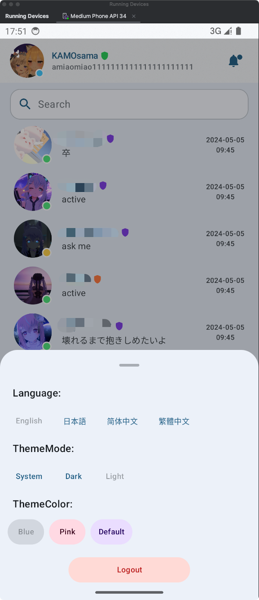
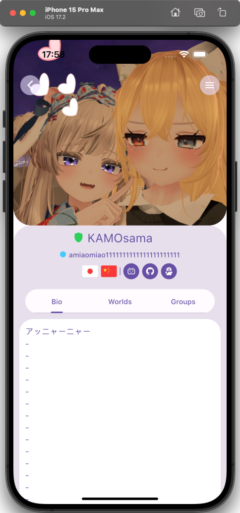

# VRCM
## A Multi-Platform friend "monitor" for VRChat.

## Features:
- Multi-platform support (Android, iOS, Desktop?)
- Friend Location
- Friend list
- Friend profile
- Notification actions( friend request, mark as read, hide...)
- Settings(i8n, theme...)
## Preview:

## TODO:

- Friend Profile actions(add friend, block...)
- World Profile UI(world name, description, tags...) and actions(favorite...)
- Group Profile UI(group name, description, tags...) and actions(favorite...)
- Notifications UI and actions(mark as read, delete...)
- Support for System Notifications

## Dependencies:
The app uses the following multiplatform dependencies in its implementation:
- [Ktor](https://ktor.io/) for networking
- [kotlinx.serialization](https://github.com/Kotlin/kotlinx.serialization) for JSON handling
- [Koin](https://github.com/InsertKoinIO/koin) for dependency injection
- [Voyager](https://github.com/adrielcafe/voyager) for shared Model implementations in common code and Navigation
- [Sultiplatform-Settings](https://github.com/russhwolf/multiplatform-settings) for Key-Value preferences
- [Jetpack Compose](https://developer.android.com/jetpack/compose)
- [Coil](https://github.com/coil-kt/coil) for image loading
