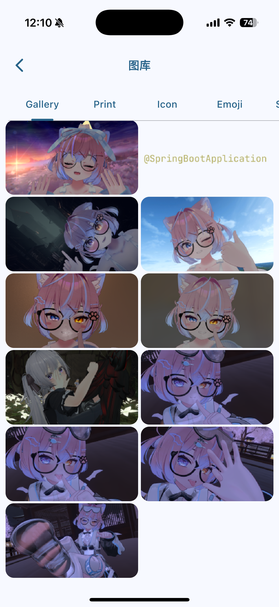
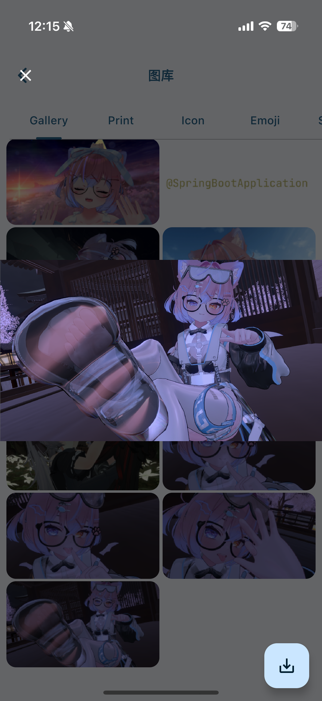
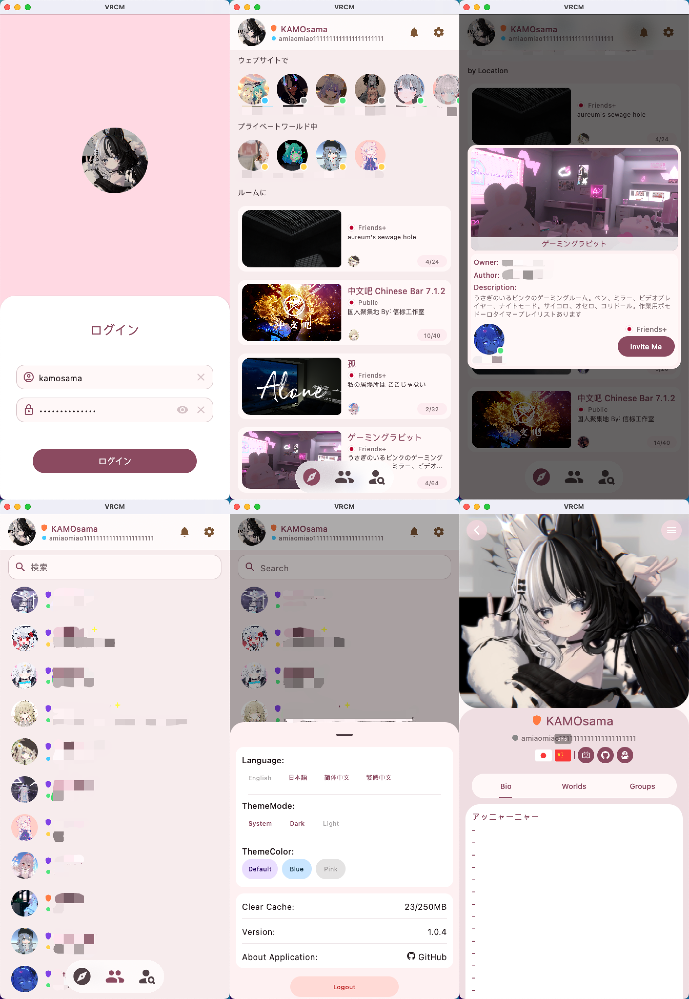

#  VRCM

<!-- Language Selection -->
**🌐 Languages / 语言 / 言語:**  
[English](README.md) • [中文](README_ZH.md) • [日本語](README_JP.md)

## マルチプラットフォーム VRChat フレンド「監視」アプリ

機能豊富なクロスプラットフォーム VRChat フレンド管理アプリケーションで、いつでもどこでもフレンドの動向を把握できます。

## ✨ コア機能

### 🔐 アカウント管理
- **マルチアカウント対応** - 異なるVRChatアカウントの素早い切り替え
- **ログイン認証** - メール、2FA認証ログインに対応

### 👥 フレンドシステム
- **フレンドリスト** - 全てのフレンドのオンライン状態とアクティビティ情報をリアルタイムで表示
- **フレンドの位置** - フレンドが現在いるワールドとルームを追跡
- **フレンドプロフィール** - 詳細なユーザー情報、ステータス、BIOなどを表示
- **フレンド管理** - 新しいフレンドの追加、フレンド削除などの完全な操作

### 🔍 検索機能
- **ユーザー検索** - ユーザー名でVRChatユーザーを素早く検索
- **ワールド検索** - VRChat内の様々なワールドを発見・検索

### 🌍 ワールド機能
- **ワールド詳細** - ワールドの詳細情報、説明、タグ、プレビュー画像を表示
- **ワールドお気に入り** - お気に入りのワールドを保存、複数のお気に入りグループ管理に対応
- **ワールドブラウジング** - 人気・おすすめワールドの閲覧
- **ルーム招待** - 自分をルームに招待可能

### 🔔 通知システム
- **リアルタイム通知** - フレンドリクエスト、招待、グループ通知などの各種通知を受信
- **通知管理** - 時間順で表示、既読マークと削除操作に対応
- **フレンドリクエスト** - フレンドリクエストの処理、招待の承認・拒否

### 🎨 インターフェース体験
- **モダンデザイン** - Material Design設計規範に準拠
- **マルチテーマ対応** - ダーク/ライトと様々なカラーテーマの切り替え
- **国際化** - 多言語インターフェースに対応
- **スムーズアニメーション** - 共有要素トランジションと美しいインタラクションアニメーション

### 🖼️ VRChat+ ギャラリー
- **写真閲覧** - ゲーム内で撮影した全ての写真を表示
- **写真ダウンロード** - お気に入りの写真をローカルデバイスに保存
- **ズームプレビュー** - 写真のズームと詳細表示に対応

  
  

## 📱 プラットフォーム対応

- ✅ **Android** - 完全機能対応
- ✅ **iOS** - 完全機能対応（自己署名が必要）

## 🖥️ インターフェースプレビュー

### マルチプラットフォームプレビュー:

### UI インターフェースプレビュー:

## 📋 開発ロードマップ

### まもなく公開:
- 📷 **ギャラリーアップロード機能** - ローカルデバイスからアルバムまたは撮影でVRChat+ギャラリーに画像をアップロード対応
- 👤 **ユーザープロフィール編集** - ユーザーの個人紹介（bio）、アバターなどのプロフィール情報の変更に対応
- 👥 **グループ機能** - グループプロフィール表示、グループルーム表示などの完全機能対応

### 将来への期待?
- 📱 **ワイドスクリーン対応** - タブレットと折りたたみスクリーンデバイスの完璧な対応、デュアルスクリーンレイアウトとマルチウィンドウ操作に対応
- 🖥️ **完全デスクトップ版** - Windows、macOS、Linux全プラットフォーム対応
- 📊 **アクティビティ履歴記録** - バックグラウンドでフレンドアクティビティ履歴を永続化記録、長期データ保存と検索に対応
- 📢 **システム通知** - ネイティブシステム通知対応
- 🤖 **スマートアシスタント** - AI駆動のフレンドアクティビティ分析

## 🛠️ 技術アーキテクチャ

### コア技術スタック
- **[Kotlin Multiplatform](https://kotlinlang.org/multiplatform/)** - クロスプラットフォーム開発フレームワーク
- **[Compose Multiplatform](https://www.jetbrains.com/lp/compose-multiplatform/)** - モダンUIフレームワーク
- **[Ktor](https://ktor.io/)** - ネットワークリクエストとAPI通信
- **[kotlinx.serialization](https://github.com/Kotlin/kotlinx.serialization)** - JSONデータシリアライゼーション

### アーキテクチャコンポーネント
- **[Koin](https://github.com/InsertKoinIO/koin)** - 依存性注入フレームワーク
- **[Voyager](https://github.com/adrielcafe/voyager)** - ナビゲーションと状態管理
- **[Multiplatform-Settings](https://github.com/russhwolf/multiplatform-settings)** - クロスプラットフォーム設定ストレージ
- **[Coil](https://github.com/coil-kt/coil)** - 高性能画像読み込み

### 開発環境
- **Kotlin API**: 2.1
- **Android SDK Target**: 35
- **Java SDK**: 21
- **Compose**: 1.8.2

## ⚠️ 免責事項

- VRCMはVRChat Incと関連がなく、VRChat Incの見解や意見を代表するものではありません
- VRCMはあなたのデバイス外でデータを保存・収集することはありません
- アプリケーション作者はこのアプリケーションが引き起こす損害について責任を負いません
- VRCMはゲームを改変・改ざんせず、[VRChat利用規約](https://hello.vrchat.com/legal)に違反しません
- このアプリケーションを合理的に使用し、関連法規とプラットフォーム規定を遵守してください

## 📄 ライセンス

本プロジェクトは[MIT ライセンス](LICENSE)でオープンソース化されています。

## 🤝 貢献

コードの貢献、問題の報告、機能提案を歓迎します！詳細については貢献ガイドをご確認ください。

---

**このプロジェクトがお役に立てば、⭐をお願いします**

[最新版をダウンロード](https://github.com/vrcm-team/VRCM/releases/latest) • [問題を報告](https://github.com/vrcm-team/VRCM/issues) • [機能提案](https://github.com/vrcm-team/VRCM/discussions)

