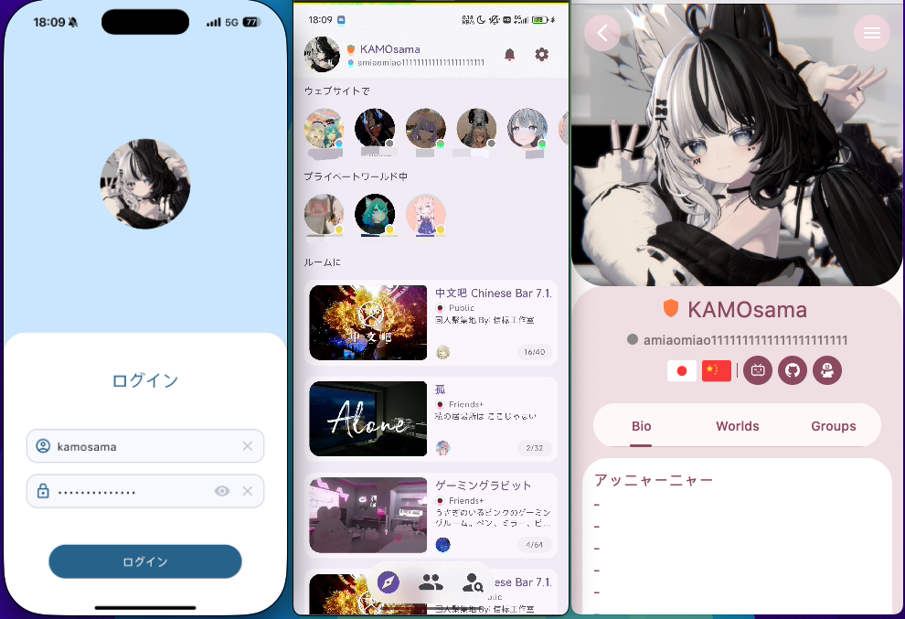
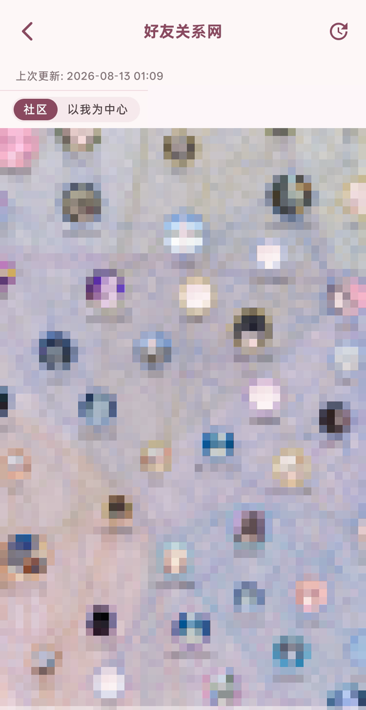
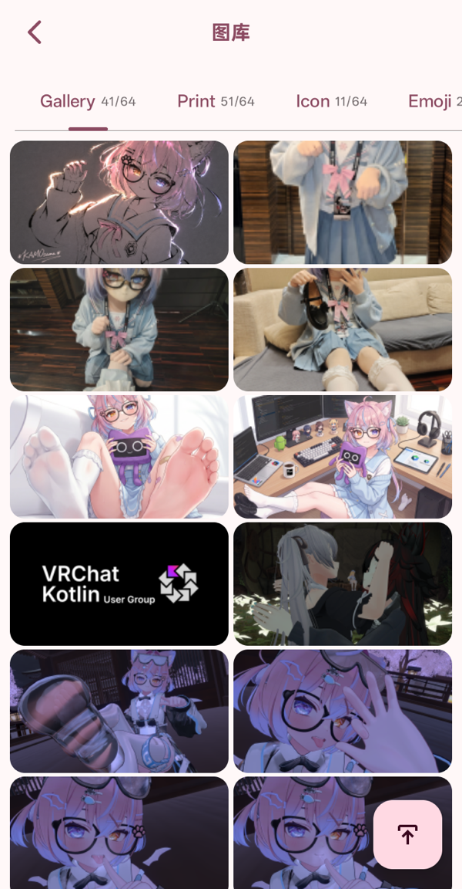
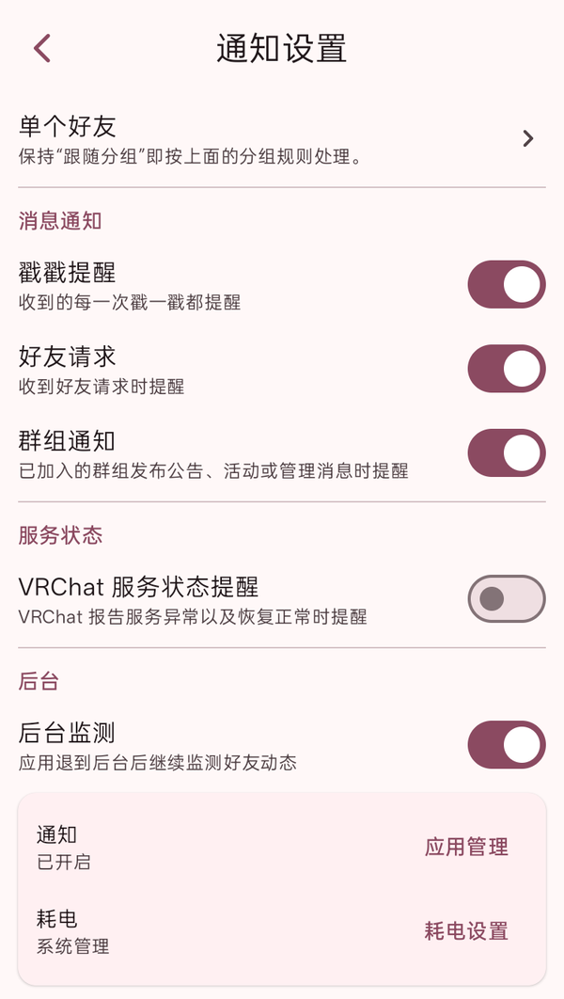
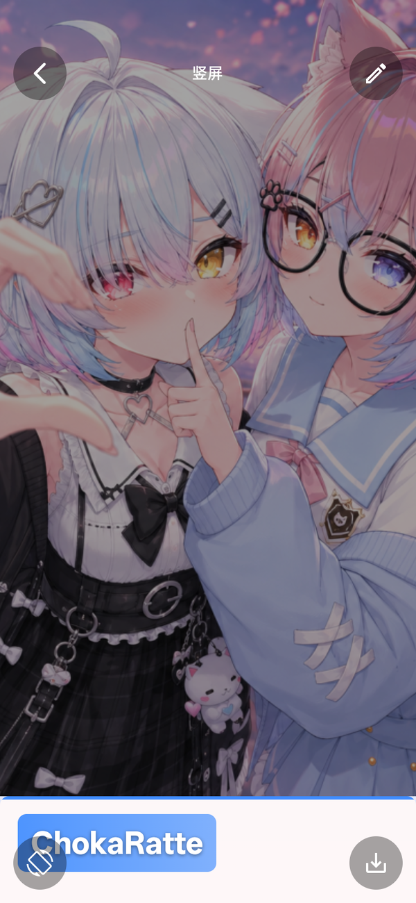

#  VRCM

**Languages / 语言 / 言語:** 
[English](README.md) · [中文](README_ZH.md) · [日本語](README_JP.md)

## VRChat の交流をスマートフォンへ

  

VRCM は、交流と使いやすさを中心に設計されたクロスプラットフォームの VRChat コンパニオンアプリです。オンライン状況の確認だけでなく、交友関係を知り、一緒に遊んだ記録を振り返り、共有リンクからワールド参加、交流、オフラインイベントまでをスマートフォン上でつなぎます。

デスクトップでの情報管理やログ閲覧を中心とするツールに対して、VRCM はモバイルで使うソーシャルデータ、タイムリーな通知、その場で実行できる交流操作を重視しています。これは製品の重点の違いであり、他プロジェクトとの互換性や代替を保証するものではありません。

[最新版をダウンロード](https://github.com/vrcm-team/VRCM/releases/latest) · [1.1.1 新機能の詳細](docs/releases/1.1.1_JP.md)

## VRCM の特徴

### 交友関係と一緒に遊んだ記録

- **フレンド関係グラフ**：共通フレンドをもとに、コミュニティ表示と自分中心表示を生成。拡大、関係確認、更新、端末内キャッシュの再利用に対応します。
- **フレンドアクティビティ**：プロフィールからオンライン/オフライン、ワールド移動、ステータスや Bio の変更を振り返れます。
- **一緒に遊んだ統計**：最後に会った日時、会った回数、一緒に遊んだ時間を記録します。
- **共通のつながり**：共通フレンドと共通グループをプロフィールの流れで確認できます。

  

> アクティビティと一緒に遊んだ時間は、VRCM の動作中に観測できた範囲のみ記録されます。Android ではバックグラウンド監視を有効にすると、アプリを閉じた後も観測を継続できます。VRChat アカウントの完全な履歴ではありません。

### モバイル向けショートカットとゲーム連携

- **クリップボード認識**：VRChat のユーザー、ワールド、グループ、アバターの公式 URL/ID をコピーし、VRCM に戻って確認すると対象ページへ直接移動できます。
- **リンクを VRCM で開く**：Android では対応する `vrchat.com` リンクを VRCM に直接渡せます。
- **システム共有**：Android/iOS の共有シートで公開プロフィール URL を共有。Desktop では URL コピーに切り替わります。
- **すぐに交流**：フレンドのインスタンス確認、自分への招待、複数種類の Boop、フレンドリクエストや招待の処理に対応します。

### スマートフォンと VRChat+ Gallery の双方向連携

- **スマートフォンから VRChat へ**：端末の写真を選んで VRChat+ Gallery にアップロード。Print はアップロード前にトリミングと構図のプレビューが可能です。
- **VRChat からスマートフォンへ**：ゲーム内で撮影して Gallery に同期された写真をシステムの写真ライブラリへ保存し、写真アプリやメッセージアプリからすぐ共有できます。
- **プレビューから直接共有**：Gallery または Print の画像を開き、Android/iOS のシステム共有シートから原画像を送信できます。共有だけでは写真ライブラリにコピーを作りません。
- **モバイル写真管理**：Gallery の閲覧、拡大、保存、一括削除に対応。非 VRC+ ユーザーも Print を閲覧できます。

  

### Android リアルタイム通知

- オンライン/オフライン通知をお気に入りグループの許可/除外ルールとフレンド別設定で絞り込めます。
- Boop、フレンドリクエスト、グループイベント、VRChat サービス状態を通知します。
- 任意のバックグラウンド監視と、通知・バッテリー管理設定への導線を備えています。
- アプリ内の独立した通知センターからイベントを確認・処理できます。

  

### オフライン交流会向けネームカード

- ホームの自分のアバターを長押しすると、交流会でスマートフォンを掲げて見せられる全画面カードを表示します。
- 情報バー、スポットライト、サイドタグの 3 テンプレートと、縦・横画面ごとの独立レイアウトに対応します。
- プロフィール背景、端末の写真、VRChat Gallery を利用し、ステータス、言語、グループ、プロフィールエフェクトも表示できます。
- VRChat プロフィールとプロフィール内ソーシャルリンクの QR コードを最大 4 個表示し、システムギャラリーに保存できます。

  

## その他の機能

- **プロフィールとコンテンツ**：ステータス、Bio、言語、代名詞、ソーシャルリンクの編集。作成ワールド、アバター、お気に入りワールドの閲覧。
- **ワールドとグループ**：ワールド/グループ検索、インスタンス、最近訪れたワールド、グループ投稿、メンバー、ギャラリー、グループインスタンスの閲覧。
- **アバター管理**：詳細表示、利用可能なアバターへの切り替え/コピー、自作アバターの名前・説明・カバー編集。
- **アカウントと UI**：複数アカウント、メール/2FA 認証、4 言語、テーマ、共有要素アニメーション、ワイド画面対応。

## プラットフォーム対応

| プラットフォーム | 対応状況 | 備考 |
| --- | --- | --- |
| Android | 完全対応 | システム通知、バックグラウンド監視、VRChat 公式リンクの受け取りを含む |
| iOS | 対応 | [自己署名](self-signing.md)が必要。Android のバックグラウンドシステム通知は非対応 |
| Desktop | 対応 | Windows、macOS、Linux のネイティブ配布。共有は URL コピーに切り替わる |

## 技術構成

- Kotlin Multiplatform 2.2.20 / Compose Multiplatform 1.10.3
- Ktor、kotlinx.serialization、Room、Coil
- Koin、Lifecycle ViewModel、Navigation 3、Material 3 Adaptive
- Android minSdk 24、targetSdk 35、compileSdk 36、Java 21

## プライバシーと免責事項

- フレンドアクティビティ、キャッシュ、ネームカード設定は端末内に保存されます。詳細は[プライバシーポリシー](privacy-policy.md)をご覧ください。
- VRCM は VRChat Inc. と関連がなく、その見解や意見を代表するものではありません。
- VRCM はゲームクライアントを改変しません。[VRChat 利用規約](https://hello.vrchat.com/legal)と各地域の法令を守ってご利用ください。
- 本アプリの利用による損害について、作者は責任を負いません。

## ライセンスと貢献

本プロジェクトは [MIT ライセンス](LICENSE)で公開されています。コードの貢献、問題報告、機能提案を歓迎します。

[問題を報告](https://github.com/vrcm-team/VRCM/issues) · [機能を提案](https://github.com/vrcm-team/VRCM/discussions)

